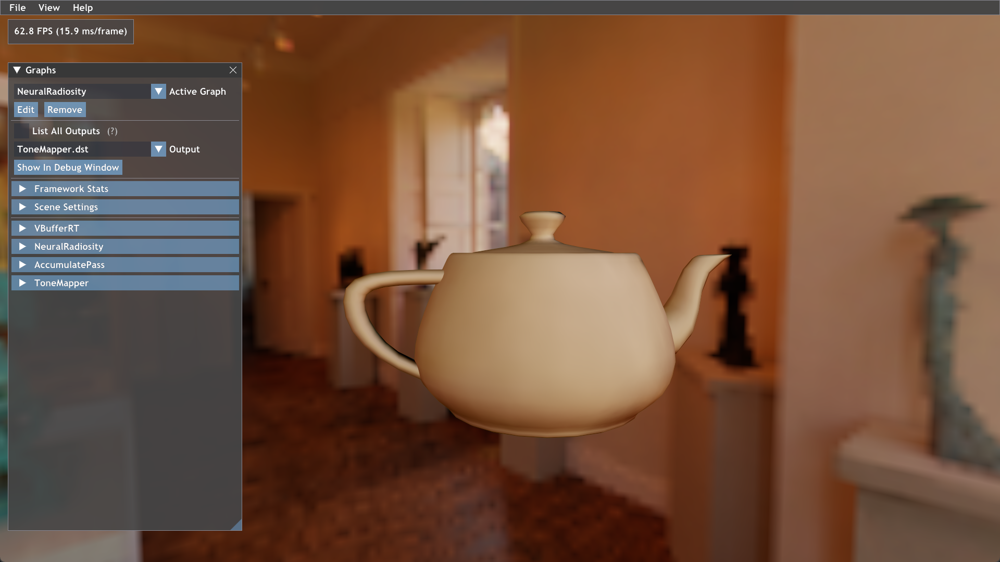

# Neural Radiosity (Falcor + tiny-cuda-nn)

This is an unofficial implementation of the paper [Neural Radiosity](https://saeedhd96.github.io/neural-radiosity/) on SIGGRAPH Asia 2021, with the help of the real-time rendering engine [Falcor](https://github.com/NVIDIAGameWorks/Falcor) and the lightning fast C++/CUDA neural network framework [tiny-cuda-nn](https://github.com/NVlabs/tiny-cuda-nn). This project reimplements the neural radiosity method while running at **over 60 FPS** for radiosity inference.

Features include:
* Randomly sample the objects within a scene based on the total surface area of a triangle mesh
* Collecting training data (Position/Normal/Incident direction/Albedo/..) for **over 1300k sampled points per second** 
* Tiny-cuda-nn script for training the neural radiosity model with hashgrid
* Integration of tiny-cuda-nn into Falcor
* Customized `NeuralRadiosity` renderpass for real-time inference


## Prerequisites

1. Refer to the original repo of [Falcor](https://github.com/NVIDIAGameWorks/Falcor) to see if your computer satisfied with the minimum requirements.
2. Refer to my another repo [Falcor-tiny-cuda-nn](https://github.com/yijie21/Falcor-tiny-cuda-nn) to integrate `tiny-cuda-nn` into `Falcor`


## Preparations for Neural Radiosity

#### Create the `CollectData` renderpass:

1. Type in the terminal in the root folder of Falcor to create the pass

   ```bash
   .\tools\make_new_render_pass.bat CollectData
   ```

2. Replace the scripts in Falcor/Source/RenderPasses/CollectData with mine in this repo

#### Create the `NeuralRadiosity` renderpass:

1. Type in the terminal in the root folder of Falcor to create the pass

   ```bash
   .\tools\make_new_render_pass.bat NeuralRadiosity
   ```

2. Replace the scripts in Falcor/Source/RenderPasses/NeuralRadiosity with mine in this repo

#### Create the tiny-cuda-nn training script:

1. Copy the folder `train_radiosity` in the root folder of `Falcor` into the root folder of `tiny-cuda-nn`

2. Add the following cmake code in the `CMakeLists.txt` in the root folder of `tiny-cuda-nn`

   ```cmake
   # add to line 283
   add_subdirectory("train_radiosity")
   ```

#### Compile

1. Recompile Falcor for the two newly created renderpass to work
2. Recompile tiny-cuda-nn to generate the executable file `train_radiosity.exe` for training


## Generate Training Data

1. Launch Falcor from Visual Studio, which will invoke the `Mogwai.exe`

2. Load the script in `Falcor/scripts/CollectData.py` to collect data for training

   ```python
   Some customizations in CollectData.py
   
   1. Select a scene for loading with:
   m.loadScene("YOUR SCENE PATH")
   
   2. Specify the number of frames to collect with:
   n_collect_frames = 500
   
   3. Specify the save folder with:
   m.frameCapture.outputDir = "YOUR SAVE FOLDER"
   ```


## Training the Neural Radiosity Model

1. After compilation of `tiny-cuda-nn`, there will be a `train_radiosity.exe` in `tiny-cuda-nn/build`, now train the model with the following command (the default network config file is in the folder `train_radiosity/composite`):

   ```bash
   .\train_radiosity.exe PATH_OF_THE_COLLECTED_DATA NETWORK_CONFIG
   ```

2. After training, the network weights will be saved in the same folder `build` named `network_weights.json`


## Neural Radiosity Inference in Falcor

1. Specify the network config file and network weights path in `Falcor/Source/RenderPasses/NeuralRadiosity/Config.h`

   ```c++
   const std::string netConfigPath = "PATH OF CONFIG FILE FOR TRAINING";
   const std::string weightsPath = "PATH OF SAVED NETWOTK WEIGTHS";
   ```

2. Recompile Falcor

3. Launch Falcor and load the script `Falcor/scripts/NeuralRadiosity.py`, please make sure the loaded scene in `NeuralRadiosity.py` and `CollectData.py` are the same scene.

4. Now everything is ready! You will see the real-time demo of neural radiosity like the teaser shown in the top of this readme.md


## Some Problems

- It seems the tiny-cuda-nn neural network does not have very strong fitting ability, since it can only show good results in a small scene with several objects, once the scene is large, the loss will not decrease to a satisfied level.
- ...


Feel free to ask me if you have any questions.


## Citation
Thanks to the authors for their amazing results:
The BibTex entry is

```bibtex
@article{10.1145/3478513.3480569,
author = {Hadadan, Saeed and Chen, Shuhong and Zwicker, Matthias},
title = {Neural Radiosity},
year = {2021},
issue_date = {December 2021},
publisher = {Association for Computing Machinery},
address = {New York, NY, USA},
volume = {40},
number = {6},
issn = {0730-0301},
url = {https://doi.org/10.1145/3478513.3480569},
doi = {10.1145/3478513.3480569},
abstract = {We introduce Neural Radiosity, an algorithm to solve the rendering equation by minimizing the norm of its residual, similar as in classical radiosity techniques. Traditional basis functions used in radiosity, such as piecewise polynomials or meshless basis functions are typically limited to representing isotropic scattering from diffuse surfaces. Instead, we propose to leverage neural networks to represent the full four-dimensional radiance distribution, directly optimizing network parameters to minimize the norm of the residual. Our approach decouples solving the rendering equation from rendering (perspective) images similar as in traditional radiosity techniques, and allows us to efficiently synthesize arbitrary views of a scene. In addition, we propose a network architecture using geometric learnable features that improves convergence of our solver compared to previous techniques. Our approach leads to an algorithm that is simple to implement, and we demonstrate its effectiveness on a variety of scenes with diffuse and non-diffuse surfaces.},
journal = {ACM Trans. Graph.},
month = {dec},
articleno = {236},
numpages = {11},
keywords = {neural rendering, neural radiance field}
}
```

If you find this implementation helpful, please consider to cite:
```bibtex
@misc{yijie2023neuralradiosity,
  title={Falcor-Neural_radiosity},
  author={Yijie, Deng},
  publisher = {GitHub},
  journal = {GitHub repository},
  howpublished={\url{https://github.com/yijie21/Neural-Radiosity-Falcor/}},
  year={2023}
}
```
